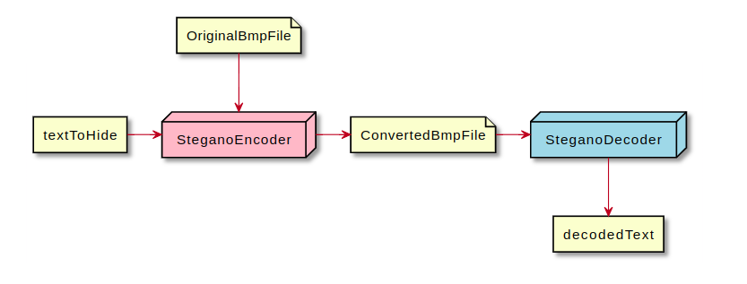

# BMP_Steganography Project

The main purpose of this project is to hide information represented as a string in *.bmp file and decode it later.

This project consists of two applications:
 - SteganoEncoder - hides string in `*Converted.bmp` file
 - SteganoDecoder - decodes data from `*Converted.bmp` file

## Working Diagram

# Links

[Steganography](https://en.wikipedia.org/wiki/Steganography)
